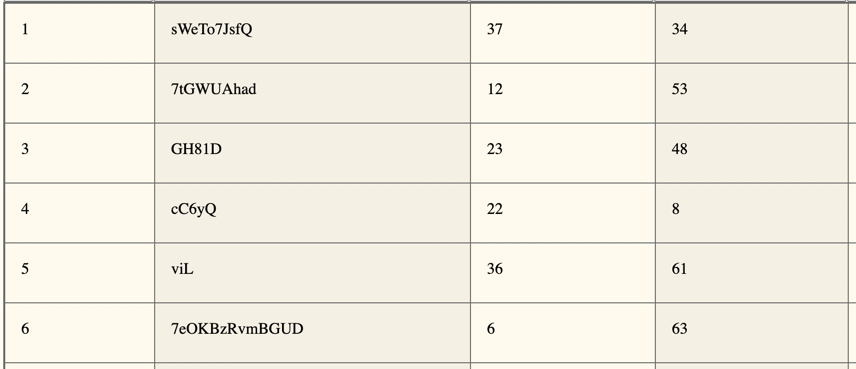
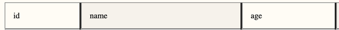
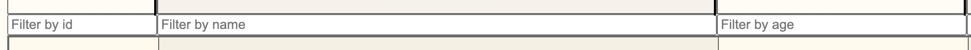
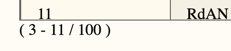

# BigLazyTables for Kolibri
This repository contains the code for the Bachelor thesis "BigLazyTables for the Kolibri Framework"

You are currently reading the documentation of BigLazyTables, a web-based table component, created as part of the [Kolibri UI Toolkit](https://webengineering-fhnw.github.io/Kolibri/index.html).

## Implementation

_For an example implementation see [/main/demo_implementations](/main/demo_implementations)._  
1. Create a new `sampleService.js` file.
2. Implement the TableService interface with its 3 methods ([serviceDoc.js](/main/BLT/table/service/serviceDoc.js)):

```
/**
 * Interface for service.
 *
 * @typedef {Object} TableService
 *
 * Applies the given filter to the data set and returns the entries
 * ranging from startIndex to endIndex from that filtered subset.
 * @property {function(Filter, number): Promise<Entry>} getDataEntry
 *
 * Fetches a single data entry.
 * Applies the given filter to the data set and returns the entry
 * with the given index from that filtered subset.
 * @property {function(Filter[], number, number): Promise<Entry[]>} getDataWithFilter
 *
 * Returns the size of the complete, unfiltered data set.
 * @property {function(): Promise<number>} getTotalDataSize
 */
```


3. Create the root DOM element in your template that will be hosting the table.
4. In your script, define the parameters for your table in a TableConfig object:
```
/**
 * Describes the object used for initializing and testing a table component.
 * @typedef {Object} TableConfig
 * @typedef {Object} ApplicationConfig
 * @typedef {Object} TestingConfig
 * @example
 * {
        app: {
            rowHeight: 60,
            nrVisibleRows: 8,
            filterObj: {
                ColumnFilters: ['', '', '', '', '', ''],
                ColumnSorter:
                    {
                        column: undefined,
                        state:  ''
                    }
            },
            columnWidths: [150, 560, 250, 150, 560, 250, 560, 540]
        },
        testing: {
            SIMULATED_FETCH_DELAY: 150,
        }
    }
 */
```
5. Then initialize the `TablePresentationModel` with newly created TableConfig.
```
const presentationModel = TablePresentationModel(tableConfig);
```
6. Initialize the `TableController` with your model and service by calling its `init()` method.
```
const tableController   = TableController(presentationModel, services);

tableController.init();
```

7. Create the view components you want for your table by using the provided ones or by implementing your own. The order dictates the position of the view inside the DOM. The `TableBody` must be implemented for the table to work.
```
TableHeadersProjector(tableController, rootElement);
FiltersProjector     (tableController, rootElement);
TableBodyProjector   (tableController, rootElement);
TableFooterProjector (tableController, rootElement);
```

## TableBody
</br></br>
**[/tableBody](/main/BLT/table/tableBody)**</br>
TableBody is the main view and must be implemented. Creates a table body element with n table rows, where n is the number of rows specified at `nrVisibleRows` in the TableConfig. Depending on the specified `rowHeight`, the table can currently supports about 250'000 data entries. 
```
TableBodyProjector(tableController, rootElement);
```

## TableHeaders
</br></br>
**[/tableHeaders](/main/BLT/table/tableHeaders)**</br>
Creates table headers similar to `<th>` for each key that is found in the data entry object. By clicking on a column, the sorting criteria on the respective column is set to empty (""), "asc" or "desc".
```
TableHeadersProjector(tableController, rootElement);
```

## TableFilters
</br></br>
**[/tableFilters](/main/BLT/table/tableFilters)**</br>
Creates an input element for each key that is found in the data entry object. On input, the filter object is updated and a new data set matching the filter is requested from the service.
```
FiltersProjector(tableController, rootElement);
```

## TableFooter
</br></br>
**[/tableFooter](/main/BLT/table/tableBody/tableFooterProjector.js)**</br>
Displays the currently visible rows in the `TableBody` with their order.
```
TableFooterProjector(tableController, rootElement);
```

